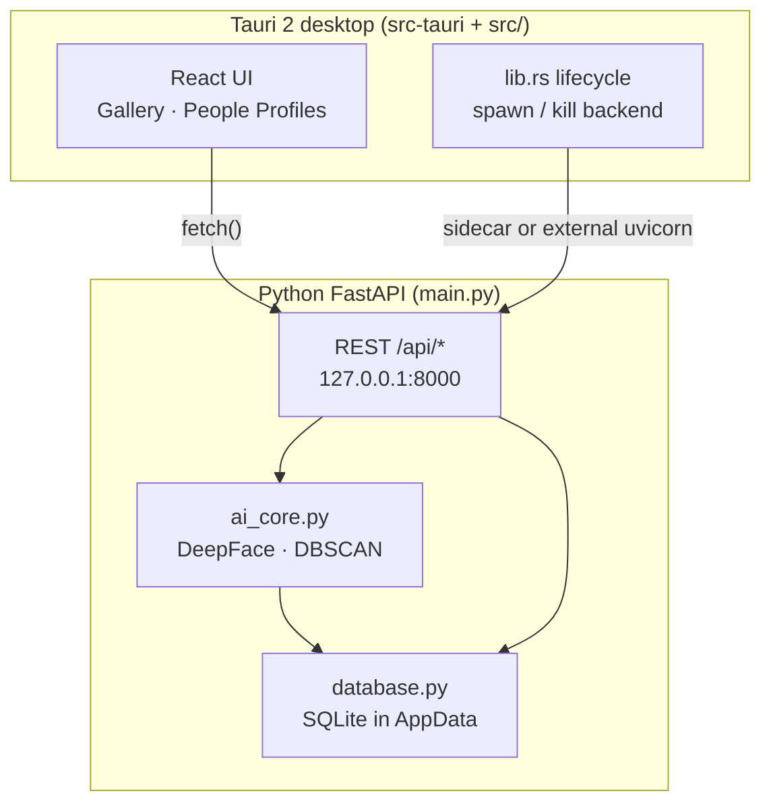

# Photo AI Detector / Photo Organizer

[](https://github.com/bialasq/photo-ai-detector)

**100% offline desktop photo organizer** with face detection, 512-dimensional embeddings, incremental DBSCAN clustering, and a Tauri 2 + React UI. All inference and storage run on your machine — no cloud APIs, no accounts.

> **Repository:** https://github.com/bialasq/photo-ai-detector

| Property | Value |
|----------|--------|
| **Backend** | Python 3.12, FastAPI, SQLite, DeepFace, TensorFlow, scikit-learn |
| **Desktop shell** | Tauri 2, React 18, TypeScript, Vite, Tailwind CSS |
| **Default API** | `http://127.0.0.1:8000` (loopback only) |
| **Database & cache** | `%AppData%\com.photo.organizer\` (`organizer.db`, `thumbnails/`, `logs/`) — not in repo root |

**Documentation:** [Architecture](docs/ARCHITECTURE.md) · [Security audit](docs/SECURITY_AUDIT.md) · [Contributing](CONTRIBUTING.md) · [API error codes](docs/API_ERROR_CODES.md)

---

## Quick start

**What it is:** Offline Windows desktop app (Tauri 2 + React) with a local Python FastAPI sidecar. Scan folders, detect faces, cluster unknown people, browse the gallery — all on CPU, no cloud.

**Requirements:** Windows 10/11 x64, **Python 3.12**, **Node.js 20**, Rust (rustup), ~4 GB RAM. **GPU:** not used in normal Windows builds — TensorFlow runs **CPU-only** (see [Known limitations](#known-limitations-gpu--scan-time) below).

```powershell
cd C:\path\to\photo-ai-detector
py -3.12 -m venv venv
.\venv\Scripts\Activate.ps1
$env:PYTHONNOUSERSITE = "1"
python -m pip install --upgrade pip
python -m pip install --no-cache-dir --no-user -r requirements.txt
npm install
run_app.bat
```

`run_app.bat` starts uvicorn in a separate window, then `npm run tauri:dev`. Alternative: backend only with `python -m uvicorn main:app --host 127.0.0.1 --port 8000`, or full details in [Running the application](#running-the-application).

**Security (summary):** Sidecar binds loopback only; `LoopbackHostMiddleware` validates `Host` (DNS rebinding); Tauri WebView CSP + backend `SecurityHeadersMiddleware`. Details: [docs/SECURITY_AUDIT.md](docs/SECURITY_AUDIT.md).

---

## Table of contents (English)

1. [Quick start](#quick-start)
2. [Product overview](#product-overview)
3. [Features](#features)
4. [Known limitations (GPU & scan time)](#known-limitations-gpu--scan-time)
5. [Architecture](#architecture)
6. [End-to-end development lifecycle](#end-to-end-development-lifecycle)
7. [Repository layout](#repository-layout)
8. [Prerequisites](#prerequisites)
9. [Python environment (3.12)](#python-environment-312)
10. [Frontend & Tauri setup](#frontend--tauri-setup)
11. [Running the application](#running-the-application)
12. [Running tests](#running-tests)
13. [HTTP API reference](#http-api-reference)
14. [Release build & sidecar packaging](#release-build--sidecar-packaging)
15. [Environment variables](#environment-variables)
16. [Data, privacy & `.gitignore`](#data-privacy--gitignore)
17. [Troubleshooting](#troubleshooting)

---

## Product overview

Photo Organizer ingests folders of JPG/PNG images on disk, detects faces, stores ArcFace embeddings in SQLite, groups unknown faces with DBSCAN, and lets you assign display names to clusters or individual “noise” faces. The gallery supports filtering by named people and AI processing status.

The project is a **monorepo at the repository root**: Python modules (`main.py`, `ai_core.py`, `database.py`) live beside the Vite/React app (`src/`) and the Tauri crate (`src-tauri/`). There is no separate `backend/` or `frontend/` folder.

---

## Features

- **Folder scan** — recursive ingestion with background progress (`phase`: `idle` → `scanning` → `clustering`). Optional cap via `PHOTO_ORGANIZER_MAX_SCAN_FILES` (default 20,000); skips system directories and drive roots.
- **Face pipeline** — DeepFace (RetinaFace / OpenCV detectors, ArcFace embeddings), cosine similarity thresholds, incremental DBSCAN. Each face stores a pixel bounding box `{x, y, w, h}` in SQLite.
- **People Profiles** — unnamed clusters with **face-cropped avatars** (server-side crop from bounding boxes), noise faces (`cluster_id` NULL), merge duplicate people, assign names via `POST /api/clusters/identify`.
- **Gallery** — grid with multi-person intersection filters and AI status: `all` / `processed` / `unprocessed` / **`faceless`** (processed photos with zero detected faces — landscapes, architecture, etc.).
- **Group photos** — one photo can contain many faces; filter by person without losing group shots. `GET /api/clusters/{id}/photos` lists every photo that contains a given cluster.
- **Search** — comma-separated person names (AND / intersection).
- **Thumbnails** — on-demand JPEGs for full photos, clusters, people, and **face-centered crops** (`GET /api/faces/{id}/thumbnail?crop=1`).
- **Faceless ingestion** — images with no faces are marked `processed=1` and `has_faces=0` so they are not rescanned indefinitely.
- **Dev helpers** — optional simulate-scan and reset-library endpoints for local testing.

---

## Known limitations (GPU & scan time)

- **CPU-only on Windows (default):** TensorFlow 2.11+ does **not** ship native GPU wheels for Windows. The app uses CPU inference; a folder scan can take **minutes** on large libraries — this is expected, not a bug.
- **Optional GPU:** Experimental CUDA setup is documented in [docs/GPU_SETUP.md](docs/GPU_SETUP.md) (Linux-oriented TF GPU path; not the default desktop install).
- **Scan progress:** `GET /api/scan-status` includes `eta_seconds` (estimated time remaining). The UI overlay shows phase and file counts; ETA display may lag backend fields.

---

## Architecture


```mermaid
flowchart TB
  subgraph desktop["Tauri 2 desktop (src-tauri + src/)"]
    UI["React UI\nGallery · People Profiles"]
    Tauri["lib.rs lifecycle\nspawn / kill backend"]
  end

  subgraph backend["Python FastAPI (main.py)"]
    API["REST /api/*\n127.0.0.1:8000"]
    AI["ai_core.py\nDeepFace · DBSCAN"]
    DB["database.py\nSQLite in AppData"]
  end

  UI -->|"fetch()"| API
  Tauri -->|"sidecar or external uvicorn"| API
  API --> AI
  AI --> DB
  API --> DB
```

**Process models**

| Mode | How the backend starts |
|------|-------------------------|
| **`run_app.bat` (recommended dev)** | Separate `cmd` window: venv + `uvicorn main:app`. Tauri gets `PHOTO_ORGANIZER_EXTERNAL_BACKEND=1` so it does not spawn a second server. |
| **`npm run tauri:dev` alone** | Tauri spawns `photo-ai-backend` sidecar (PyInstaller binary) or, in debug, falls back to `python main.py` if the binary is missing. |
| **`python main.py`** | Direct Uvicorn entrypoint for backend-only debugging. |

---

## End-to-end development lifecycle

This section documents how the application was built — useful for onboarding and future contributors.

### Phase 1 — Persistence & domain model (`database.py`)

- Designed SQLite schema: `photos` (1) → (N) `faces`, `people`, embeddings as BLOBs, `bounding_box` JSON per face, `cluster_id` / `person_id` linkage.
- `photos.has_faces` flag distinguishes processed images with no detections (faceless) from pending work.
- Implemented `DatabaseManager` with validation, migrations-style helpers, gallery/search queries, noise-face queries, exemplar-face summaries for UI crops, and merge semantics.
- Local DB path: **`%AppData%\com.photo.organizer\organizer.db`** (task 1.2.2). Override with `PHOTO_ORGANIZER_APP_DATA` or `PHOTO_ORGANIZER_DB_PATH` for dev/tests. Legacy `organizer.db` in repo root is migrated on first run if present.

### Phase 2 — Offline AI core (`ai_core.py`)

- Integrated **DeepFace** for detection + 512-d ArcFace embeddings.
- Implemented cosine-distance matching, boundary queue, and **DBSCAN** incremental clustering (scikit-learn).
- Noise faces persist with `cluster_id` NULL (not a dedicated “-1” row convention in storage).
- Hardened image I/O for Windows paths (including non-ASCII filenames).

### Phase 3 — Local HTTP API (`main.py`)

- FastAPI app with `/health` and `/api/*` routes.
- Background asyncio scan tasks with thread-safe `ScanProgressState` (`phase`, `current_file`, `last_error`).
- Thumbnail generation (Pillow) and static file streaming for full-resolution viewing.
- Dev-only routes (require `PHOTO_ORGANIZER_DEV=1` on the sidecar): `POST /api/dev/reset-library`, `POST /api/dev/simulate-scan`. Unset in release builds — routes return 404.

### Phase 4 — Desktop shell (Tauri 2 + React)

- Vite + React + TypeScript + Tailwind UI (`src/`).
- `AppContext` — health polling, scan overlay (500 ms poll), `dataRefreshToken` for gallery/people refresh.
- Tauri plugins: `dialog` (folder picker), `shell` (sidecar spawn).
- CSP allows `connect-src` to `http://127.0.0.1:8000` only.

### Phase 5 — Sidecar packaging & dev launcher

- `scripts/package-sidecar.ps1` — PyInstaller → `src-tauri/binaries/photo-ai-backend-<triple>.exe`.
- `src-tauri/backend-launcher/` — Rust stub built by `build.rs` when the PyInstaller binary is absent (satisfies Tauri `externalBin` at compile time).
- `PHOTO_ORGANIZER_EXTERNAL_BACKEND` — skip duplicate backend when using `run_app.bat`.

### Phase 6 — Environment hardening (Python 3.12)

- **TensorFlow** and **DeepFace** do not support Python 3.14 on Windows; the project standardizes on **Python 3.12.10** via `py -3.12 -m venv venv`.
- `PYTHONNOUSERSITE=1` in `run_app.bat` prevents accidental imports from the user site-packages directory under `%AppData%`.
- Use **PowerShell** (or `cmd`) for `pip` — avoid Git Bash `pip`, which may target the wrong interpreter.

---

## Repository layout

| Path | Role |
|------|------|
| `main.py` | FastAPI application, route registration, scan orchestration |
| `ai_core.py` | Face detection, embeddings, DBSCAN clustering engine |
| `database.py` | SQLite access layer |
| `requirements.txt` | Python dependencies (TensorFlow, DeepFace, FastAPI, …) |
| `run_app.bat` | One-click dev: backend window + `npm run tauri:dev` |
| `src/` | React UI (`components/`, `context/`, `services/api.ts`) |
| `src-tauri/` | Tauri 2 Rust project, `tauri.conf.json`, capabilities |
| `src-tauri/backend-launcher/` | Dev-only sidecar stub (Rust) |
| `scripts/package-sidecar.ps1` | PyInstaller packaging for release sidecar |
| `reset_db.py` | Local utility to wipe ingestion tables (uses local DB) |
| `check_db.py` | Local SQLite inspection script (dev) |

---

## Prerequisites

| Tool | Notes |
|------|--------|
| **Python 3.12** | `py -3.12 --version` — required for TensorFlow wheels on Windows |
| **Node.js 20** | Matches CI (`.github/workflows/ci.yml`); for Vite and Tauri CLI |
| **Windows 10/11 x64** | Primary supported platform for v1.0 |
| **Rust (rustup)** | For `tauri dev` / `tauri build` |
| **Microsoft Visual C++ Redistributable** | Often required by TensorFlow native DLLs on Windows |

Optional: **PyInstaller** (installed automatically by `npm run sidecar:package`).

---

## Python environment (3.12)

From the repository root in **PowerShell**:

```powershell
cd C:\path\to\photo-ai-detector

# 1. Create venv with the 3.12 launcher (not plain python if it points to 3.14)
py -3.12 -m venv venv

# 2. Activate
.\venv\Scripts\Activate.ps1

# 3. Block global user-site packages
$env:PYTHONNOUSERSITE = "1"

# 4. Upgrade installer tooling
python -m pip install --upgrade pip setuptools wheel

# 5. Install project dependencies (no cache = clean wheels)
python -m pip install --no-cache-dir --no-user -r requirements.txt

# 6. Verify AI stack
python -c "import numpy; import PIL; import tensorflow; import deepface; print('FULL AI STACK OK')"
```

**Important:** Do not use Python 3.14 for this project. `pip` will not find TensorFlow wheels, and mixed `cp312` / `cp314` binaries in `site-packages` cause import failures.

---

## Frontend & Tauri setup

```powershell
npm install
```

Type-check and build the web assets:

```powershell
npm run build
```

---

## Running the application

### Recommended — `run_app.bat`

Double-click or run from `cmd`:

```bat
run_app.bat
```

Steps performed:

1. Validates `venv\Scripts\activate.bat`
2. Opens **Photo Organizer - Backend** with `PYTHONNOUSERSITE=1` and `uvicorn main:app --host 127.0.0.1 --port 8000`
3. Waits 5 seconds for model load
4. Sets `PHOTO_ORGANIZER_EXTERNAL_BACKEND=1` and runs `npm run tauri:dev`
5. On exit, kills the backend window and any process on port 8000

### Backend only

```powershell
.\venv\Scripts\Activate.ps1
$env:PYTHONNOUSERSITE = "1"
python -m uvicorn main:app --host 127.0.0.1 --port 8000 --log-level info
```

OpenAPI docs: **http://127.0.0.1:8000/docs**

### Desktop without `run_app.bat`

```powershell
npm run tauri:dev
```

---

## Running tests

From the repository root with venv activated (`.\venv\Scripts\Activate.ps1`):

```powershell
venv\Scripts\python.exe -m pytest -m "not slow" -q
npm test
```

CI (`.github/workflows/ci.yml`) also runs `pytest -m "not slow and not integration_slow"` on Ubuntu and `npm ci` + `npm run build`. See [CONTRIBUTING.md](CONTRIBUTING.md) for branch workflow and job overview.

---

## HTTP API reference

Base URL: **`http://127.0.0.1:8000`**. The React client is implemented in `src/services/api.ts`.

| Method | Path | Purpose |
|--------|------|---------|
| `GET` | `/health` | Liveness (`{ "status": "ok" }`) |
| `POST` | `/api/scan-folder` | Start background folder ingestion |
| `GET` | `/api/scan-status` | Poll `processed`, `total`, `is_active`, `phase`, `current_file` (basename), `last_error`, `eta_seconds`, `cancelled` |
| `GET` | `/api/gallery` | Gallery list (`person_ids`, `ai_status` = `all` \| `processed` \| `unprocessed` \| `faceless`) |
| `GET` | `/api/search` | Intersection search by comma-separated names |
| `GET` | `/api/people` | People summaries with `exemplar_face_id` and `bounding_box` for UI crops |
| `POST` | `/api/people/merge` | Merge source person into target |
| `GET` | `/api/clusters/unnamed` | Unnamed cluster summaries (exemplar face, bbox, `thumbnail_url`) |
| `GET` | `/api/clusters/{id}/photos` | All photos containing any face in the cluster (group shots included) |
| `GET` | `/api/clusters/noise` | DBSCAN noise faces with bbox and crop thumbnail URLs |
| `POST` | `/api/clusters/identify` | Name cluster or assign noise face (new or existing person) |
| `GET` | `/api/photos/{id}/thumbnail` | Resized photo thumbnail |
| `GET` | `/api/photos/{id}/file` | Full image bytes |
| `GET` | `/api/clusters/{id}/thumbnail` | Cluster representative thumbnail (full frame) |
| `GET` | `/api/faces/{id}/thumbnail` | Face thumbnail; add `?crop=1` for bbox-centered crop |
| `GET` | `/api/people/{id}/thumbnail` | Person avatar thumbnail |
| `POST` | `/api/dev/reset-library` | Clear ingestion data (**dev only**, `PHOTO_ORGANIZER_DEV=1`) |
| `POST` | `/api/dev/simulate-scan` | Scan a test folder (**dev only**) |

**Versioned routes (`/api/v1/*`):** see [docs/API_VERSIONING.md](docs/API_VERSIONING.md).

| Method | Path | Purpose |
|--------|------|---------|
| `GET` | `/api/v1/health` | Versioned liveness (`api_version: v1`) |
| `POST` | `/api/v1/log-error` | React Error Boundary reports (204) |
| `POST` | `/api/v1/scan-cancel` | Request scan cancellation |
| `GET` | `/api/v1/clusters/health` | Latest DBSCAN quality metrics |

**Naming rule:** There is no `/api/people/name` route. Assigning display names always goes through **`POST /api/clusters/identify`** with `{ cluster_id, name }` or `{ face_id, name | person_id }`.

---

## Release build & sidecar packaging

```powershell
.\venv\Scripts\Activate.ps1
$env:PYTHONNOUSERSITE = "1"
npm run sidecar:package   # PyInstaller → src-tauri/binaries/photo-ai-backend-<triple>.exe
npm run tauri:build
```

Packaged binaries matching `photo-ai-backend-*` are **gitignored**; only sources and `src-tauri/binaries/README.md` are tracked.

---

## Environment variables

| Variable | Used by | Description |
|----------|---------|-------------|
| `PYTHONNOUSERSITE=1` | Python | Ignore user site-packages (set in `run_app.bat`) |
| `PHOTO_ORGANIZER_APP_DATA` | `database.py` | Override AppData root (default `%AppData%\com.photo.organizer` on Windows) |
| `PHOTO_ORGANIZER_DB_PATH` | `database.py` | Override SQLite file path (dev/tests) |
| `PHOTO_ORGANIZER_DEV=1` | `main.py` | Enable `/api/dev/*` and OpenAPI `/docs` |
| `PHOTO_ORGANIZER_EXTERNAL_BACKEND=1` | Tauri | Do not spawn sidecar; use existing server |
| `PHOTO_ORGANIZER_HOST` | `main.py` / sidecar | Bind host (default `127.0.0.1`) |
| `PHOTO_ORGANIZER_PORT` | `main.py` / sidecar | Bind port (default `8000`) |
| `PHOTO_AI_PROJECT_ROOT` | Sidecar | Project root for `python main.py` fallback |
| `PHOTO_AI_PYTHON` | `package-sidecar.ps1` | Override Python executable for PyInstaller |
| `TF_ENABLE_ONEDNN_OPTS=0` | TensorFlow | Optional: disable oneDNN info messages |
| `PHOTO_ORGANIZER_MAX_SCAN_FILES` | Scan pipeline | Max image files per folder scan (default `20000`) |

---

## Data, privacy & `.gitignore`

The following are **never committed** (see `.gitignore`):

- `venv/`, `node_modules/`, `src-tauri/target/`
- Local databases under AppData or dev overrides (`*.db`, `organizer.db` in repo root from legacy dev)
- `.env`, `.env.*`
- PyInstaller outputs: `dist-sidecar/`, `build-sidecar/`, `src-tauri/binaries/photo-ai-backend-*`
- Logs and IDE folders

**Runtime data** lives under `%AppData%\com.photo.organizer\` (SQLite, thumbnail LRU cache, rotating logs). Your photo library paths and face embeddings stay on your machine only.

---

## Troubleshooting

| Symptom | Likely cause | Fix |
|---------|----------------|-----|
| `No matching distribution found for tensorflow` | Python 3.14+ | Recreate venv with `py -3.12 -m venv venv` |
| `DLL load failed` / wrong `.pyd` tag (`cp312` vs `cp314`) | Mixed interpreters or user-site pollution | Delete `venv`, reinstall with `PYTHONNOUSERSITE=1`, use PowerShell `python -m pip` |
| Port 8000 already in use | Stale backend | Close “Photo Organizer - Backend” or run `run_app.bat` cleanup |
| Tauri window blank / API errors | Backend not ready | Wait for `/health`, check backend console |
| `pip` installs to AppData | Git Bash or wrong `python` | Activate venv; use `python -m pip install --no-user` |

---

## License

Private project — all rights reserved unless stated otherwise.

---

---

# Photo AI Detector / Photo Organizer — dokumentacja po polsku

**Offline’owy organizer zdjęć na desktopie** z detekcją twarzy, embeddingami 512-wymiarowymi, klasteryzacją DBSCAN i interfejsem Tauri 2 + React. Całe przetwarzanie i baza danych działają lokalnie — bez chmury i kont.

| Właściwość | Wartość |
|------------|---------|
| **Backend** | Python 3.12, FastAPI, SQLite, DeepFace, TensorFlow, scikit-learn |
| **Aplikacja desktop** | Tauri 2, React 18, TypeScript, Vite, Tailwind CSS |
| **Domyślne API** | `http://127.0.0.1:8000` (tylko loopback) |
| **Baza i cache** | `%AppData%\com.photo.organizer\` (nie w katalogu repo) |

Szczegóły po angielsku: [Quick start](#quick-start), [Running tests](#running-tests), [CONTRIBUTING.md](CONTRIBUTING.md).

---

## Spis treści (polski)

1. [Opis produktu](#opis-produktu)
2. [Funkcje](#funkcje)
3. [Architektura](#architektura-1)
4. [Cykl tworzenia aplikacji](#cykl-tworzenia-aplikacji)
5. [Struktura repozytorium](#struktura-repozytorium)
6. [Wymagania](#wymagania)
7. [Środowisko Python 3.12](#środowisko-python-312)
8. [Frontend i Tauri](#frontend-i-tauri)
9. [Uruchamianie](#uruchamianie)
10. [API HTTP](#api-http)
11. [Build produkcyjny i sidecar](#build-produkcyjny-i-sidecar)
12. [Zmienne środowiskowe](#zmienne-środowiskowe)
13. [Dane, prywatność i `.gitignore`](#dane-prywatność-i-gitignore)
14. [Rozwiązywanie problemów](#rozwiązywanie-problemów)

---

## Opis produktu

Photo Organizer skanuje foldery ze zdjęciami JPG/PNG, wykrywa twarze, zapisuje embeddingi ArcFace w SQLite, grupuje nieznane twarze algorytmem DBSCAN i pozwala przypisać imiona do klastrów lub pojedynczych twarzy „szumu” (noise). Galeria obsługuje filtrowanie po osobach i statusie przetworzenia AI.

Projekt to **monorepo w katalogu głównym**: moduły Pythona (`main.py`, `ai_core.py`, `database.py`) leżą obok aplikacji Vite/React (`src/`) i crate’a Tauri (`src-tauri/`).

---

## Funkcje

- **Skan folderów** — rekurencyjna ingesta z postępem w tle; limit `PHOTO_ORGANIZER_MAX_SCAN_FILES`, pomijanie katalogów systemowych.
- **Pipeline twarzy** — DeepFace, embeddingi ArcFace, DBSCAN; bbox `{x, y, w, h}` w bazie dla każdej twarzy.
- **People Profiles** — miniatury z kadrowaniem twarzy, klastry bezimienne, twarze noise, scalanie osób.
- **Galeria** — filtry osób (AND) i status AI, w tym **`faceless`** (zdjęcia bez twarzy).
- **Zdjęcia grupowe** — relacja 1 zdjęcie → N twarzy; `GET /api/clusters/{id}/photos`.
- **Wyszukiwanie** — lista imion rozdzielona przecinkami (przecięcie).
- **Miniatury** — JPEG z opcją `?crop=1` dla twarzy.
- **Zdjęcia bez twarzy** — `has_faces=0`, bez ponownego skanowania w pętli.
- **Narzędzia dev** — opcjonalny simulate-scan i reset biblioteki.

---

## Architektura

Diagram i tryby uruchomienia — jak w sekcji angielskiej [Architecture](#architecture):

- **`run_app.bat`** — osobne okno uvicorn + Tauri z `PHOTO_ORGANIZER_EXTERNAL_BACKEND=1`.
- **`npm run tauri:dev`** — sidecar PyInstaller lub fallback `python main.py`.
- **`python main.py`** — sam backend do debugowania.

---

## Cykl tworzenia aplikacji

Krótki opis faz rozwoju projektu (onboarding):

### Faza 1 — Warstwa danych (`database.py`)

Schemat SQLite (`photos`, `faces`, `people`), embeddingi jako BLOB, zapytania galerii/wyszukiwania, twarze noise, scalanie osób. Baza: **`%AppData%\com.photo.organizer\organizer.db`** (nie w root repo).

### Faza 2 — Silnik AI (`ai_core.py`)

DeepFace, podobieństwo cosinusowe, kolejka graniczna, DBSCAN (scikit-learn). Twarze noise: `cluster_id` NULL w bazie. Obsługa ścieżek Windows (w tym znaków spoza ASCII).

### Faza 3 — API HTTP (`main.py`)

FastAPI, skan w tle, `ScanProgressState`, miniatury Pillow, endpointy dev.

### Faza 4 — UI desktop (Tauri 2 + React)

`AppContext`, overlay skanu, odświeżanie galerii i profili, plugin `dialog` (wybór folderu), CSP ograniczające połączenia do `127.0.0.1:8000`.

### Faza 5 — Sidecar i launcher

`scripts/package-sidecar.ps1`, `backend-launcher` w Rust (stub na czas dev), zmienna `PHOTO_ORGANIZER_EXTERNAL_BACKEND`.

### Faza 6 — Utwardzenie środowiska (Python 3.12)

TensorFlow i DeepFace **nie wspierają Pythona 3.14** na Windows. Standard projektu: **`py -3.12 -m venv venv`**, `PYTHONNOUSERSITE=1` w `run_app.bat`, instalacje `pip` z PowerShell (nie Git Bash).

---

## Struktura repozytorium

| Ścieżka | Rola |
|---------|------|
| `main.py` | Aplikacja FastAPI, trasy, orchestracja skanu |
| `ai_core.py` | Detekcja, embeddingi, DBSCAN |
| `database.py` | SQLite |
| `requirements.txt` | Zależności Pythona |
| `run_app.bat` | Dev jednym kliknięciem |
| `src/` | React UI |
| `src-tauri/` | Tauri 2, konfiguracja, uprawnienia |
| `scripts/package-sidecar.ps1` | Pakowanie sidecara PyInstaller |

---

## Wymagania

| Narzędzie | Uwagi |
|-----------|--------|
| **Python 3.12** | `py -3.12 --version` |
| **Node.js 20** | Vite, Tauri CLI (zgodnie z CI) |
| **Windows 10/11 x64** | Platforma docelowa v1.0 |
| **Rust (rustup)** | `tauri dev` / `tauri build` |
| **VC++ Redistributable** | Często wymagany przez TensorFlow na Windows |

---

## Środowisko Python 3.12

W **PowerShell** z katalogu projektu:

```powershell
cd C:\ścieżka\do\photo-ai-detector
py -3.12 -m venv venv
.\venv\Scripts\Activate.ps1
$env:PYTHONNOUSERSITE = "1"
python -m pip install --upgrade pip setuptools wheel
python -m pip install --no-cache-dir --no-user -r requirements.txt
python -c "import numpy; import PIL; import tensorflow; import deepface; print('FULL AI STACK OK')"
```

**Nie używaj Pythona 3.14** — brak wheeli TensorFlow i ryzyko pomieszania rozszerzeń `cp312` / `cp314`.

---

## Frontend i Tauri

```powershell
npm install
npm run build    # opcjonalnie: weryfikacja TypeScript + Vite
```

---

## Uruchamianie

### Zalecane — `run_app.bat`

Uruchamia okno backendu z `PYTHONNOUSERSITE=1` i uvicorn, czeka 5 s, ustawia `PHOTO_ORGANIZER_EXTERNAL_BACKEND=1`, startuje `npm run tauri:dev`, przy zamknięciu czyści port 8000.

### Sam backend

```powershell
.\venv\Scripts\Activate.ps1
$env:PYTHONNOUSERSITE = "1"
python -m uvicorn main:app --host 127.0.0.1 --port 8000
```

Dokumentacja OpenAPI: **http://127.0.0.1:8000/docs**

### Samo Tauri

```powershell
npm run tauri:dev
```

---

## API HTTP

Bazowy URL: **`http://127.0.0.1:8000`**. Klient: `src/services/api.ts`.

| Metoda | Ścieżka | Opis |
|--------|---------|------|
| `GET` | `/health` | Sprawdzenie żywotności |
| `POST` | `/api/scan-folder` | Start skanu folderu |
| `GET` | `/api/scan-status` | Postęp skanu (`eta_seconds`, fazy, basename `current_file`) |
| `GET` | `/api/gallery` | Galeria (`person_ids`, `ai_status` + `faceless`) |
| `GET` | `/api/search` | Wyszukiwanie po imionach (AND) |
| `GET` | `/api/people` | Lista osób (z bbox exemplar) |
| `POST` | `/api/people/merge` | Scalanie profili |
| `GET` | `/api/clusters/unnamed` | Podsumowania klastrów z bbox i URL miniatury |
| `GET` | `/api/clusters/{id}/photos` | Zdjęcia danego klastra |
| `GET` | `/api/clusters/noise` | Twarze noise |
| `POST` | `/api/clusters/identify` | Nadanie imienia klastrowi / twarzy |
| `GET` | `/api/photos/{id}/thumbnail` | Miniatura zdjęcia |
| `GET` | `/api/photos/{id}/file` | Pełny plik |
| `GET` | `/api/clusters/{id}/thumbnail` | Miniatura klastra |
| `GET` | `/api/faces/{id}/thumbnail` | Miniatura twarzy |
| `GET` | `/api/people/{id}/thumbnail` | Awatar osoby |
| `POST` | `/api/dev/reset-library` | Reset danych (**tylko dev**, `PHOTO_ORGANIZER_DEV=1`) |
| `POST` | `/api/dev/simulate-scan` | Testowy skan (**tylko dev**) |

Trasy `/api/v1/*`: `health`, `log-error`, `scan-cancel`, `clusters/health` — patrz sekcja angielska [HTTP API reference](#http-api-reference).

**Ważne:** Nie ma endpointu `/api/people/name` — nazwy zawsze przez **`POST /api/clusters/identify`**.

---

## Build produkcyjny i sidecar

```powershell
npm run sidecar:package
npm run tauri:build
```

Binaria `photo-ai-backend-*` są w `.gitignore`.

---

## Zmienne środowiskowe

| Zmienna | Opis |
|---------|------|
| `PYTHONNOUSERSITE=1` | Blokada pakietów z user site (AppData) |
| `PHOTO_ORGANIZER_EXTERNAL_BACKEND=1` | Tauri nie uruchamia drugiego backendu |
| `PHOTO_ORGANIZER_HOST` / `PORT` | Adres serwera API |
| `PHOTO_AI_PROJECT_ROOT` | Korzeń projektu dla fallbacku Pythona |
| `PHOTO_AI_PYTHON` | Interpreter do PyInstaller |

---

## Dane, prywatność i `.gitignore`

Do repozytorium **nie trafiają**: `venv/`, bazy `*.db`, `.env`, zdjęcia użytkownika, binaria sidecara, `node_modules/`, artefakty build Rust. Dane runtime: **`%AppData%\com.photo.organizer\`**.

Ścieżki do Twoich albumów i embeddingi twarzy pozostają wyłącznie na dysku lokalnym.

---

## Rozwiązywanie problemów

| Objaw | Przyczyna | Rozwiązanie |
|-------|-----------|-------------|
| Brak pakietu `tensorflow` | Python 3.14 | `py -3.12 -m venv venv` i czysta instalacja |
| Błąd DLL / zły tag `.pyd` | Pomieszane wersje Pythona | Usuń `venv`, `PYTHONNOUSERSITE=1`, `python -m pip` w PowerShell |
| Port 8000 zajęty | Stary proces | Zamknij okno backendu lub użyj cleanup z `run_app.bat` |
| Puste okno Tauri | Backend nie działa | Sprawdź `/health` i logi uvicorn |

---

## Licencja

Projekt prywatny — wszelkie prawa zastrzeżone, o ile nie określono inaczej.
