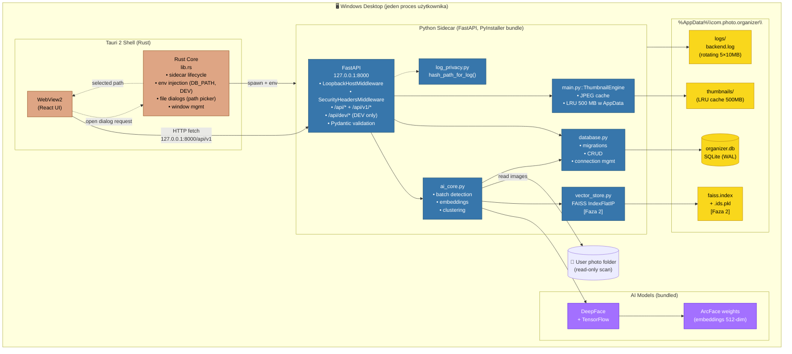
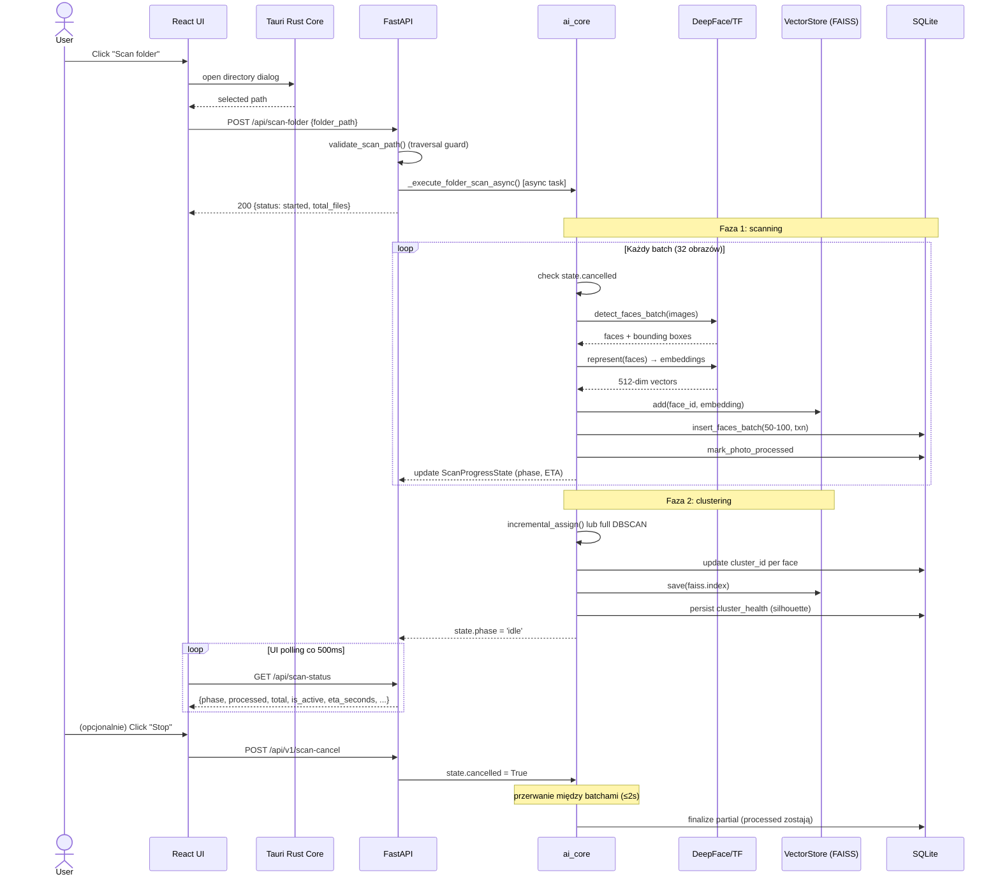
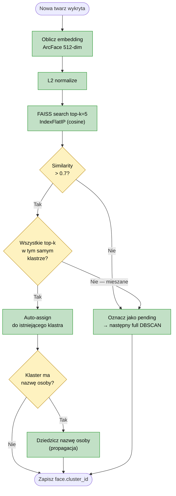
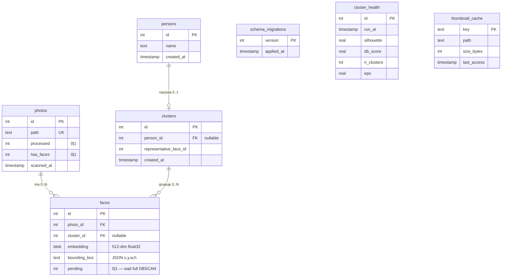
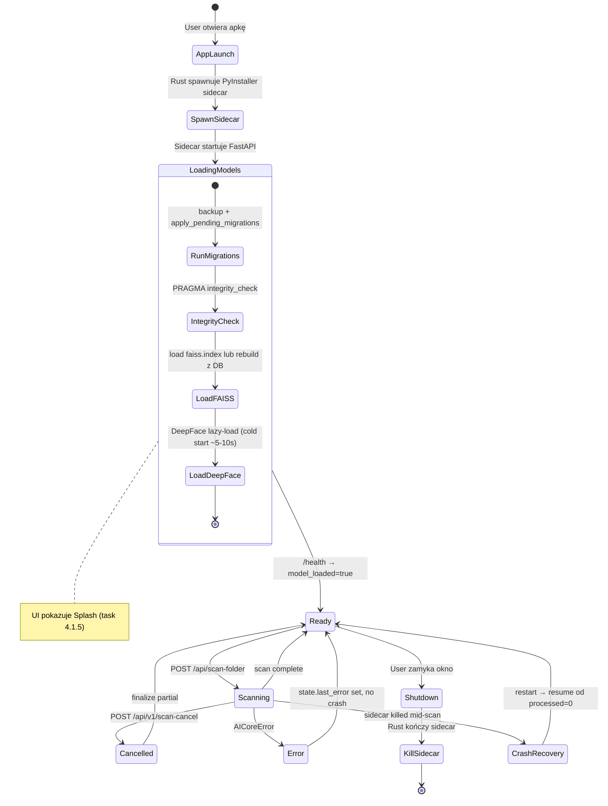
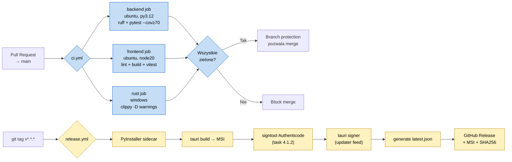

# Architecture — Photo AI Detector

> **Status:** target architecture po Fazie 2 (z FAISS). Sekcje oznaczone `[Faza 2]` opisują stan po wdrożeniu vector store; przed tym embeddingi są przeszukiwane liniowo w SQLite.
> **Stack:** Tauri 2 (Rust shell) + React/TypeScript (webview) + FastAPI sidecar (Python) + SQLite + FAISS + DeepFace/TensorFlow.
> **Model wdrożenia:** offline-first desktop app, Windows 10/11 x64. Brak chmury, brak telemetrii (poza opt-in Sentry).

---

## 1. Component diagram (wysokopoziomowy)



**Kluczowa zasada bezpieczeństwa:** sidecar nasłuchuje wyłącznie na `127.0.0.1` (loopback). WebView łączy się przez HTTP do `127.0.0.1:8000`. Żaden ruch nie opuszcza maszyny. `/api/dev/*` rejestrowane tylko gdy `PHOTO_ORGANIZER_DEV=1` (nigdy w release).

---

## 2. Scan flow (sequence diagram)



**Recovery:** Jeśli sidecar padnie (crash / kill) w trakcie skanu, zdjęcia z `processed=1` zostają w DB. Po restarcie skan wznawia od pierwszego `processed=0` — żadna praca nie jest tracona, brak duplikatów.

---

## 3. Face identification flow [Faza 2 — FAISS]



**Dlaczego FAISS + DBSCAN razem (a nie zamiast):** FAISS daje O(1)-ish identyfikację pojedynczej nowej twarzy względem znanych (sub-50 ms na 100k embeddingów). DBSCAN robi globalne re-grupowanie (kosztowne, ale rzadkie — przy dużych przyrostach albo na żądanie). Mieszane wyniki top-k odkładamy do następnego pełnego re-clusteringu zamiast ryzykować błędne sklejenie różnych osób.

---

## 4. Data model (ERD)



**Indeksy krytyczne (task 1.3.1):** `idx_faces_person_id`, `idx_faces_photo_id`, `idx_photos_processed (processed, has_faces)`, `idx_thumbnail_last_access`. Cel: query galerii < 100 ms p95 przy 50k zdjęć / 100k twarzy.

---

## 5. AppData layout

```
%AppData%\com.photo.organizer\
├── organizer.db              # SQLite (WAL mode)
├── organizer.db-wal          # Write-Ahead Log
├── organizer.db-shm          # Shared memory
├── organizer.db.bak.{N}      # Backup przed migracją N (task 1.3.2)
├── faiss.index               # [Faza 2] FAISS persisted index
├── faiss.index.ids.pkl       # [Faza 2] face_id mapping
├── thumbnails\               # LRU cache (limit 500 MB, task 2.3.3)
│   ├── {hash1}.jpg
│   └── {hash2}.jpg
├── logs\                     # Rotating (5 × 10 MB, task 1.1.2)
│   ├── backend.log
│   ├── backend.log.1
│   └── ...
└── settings.json             # User prefs (telemetry opt-in, GPU flag)
```

**Ścieżka rozwiązywana przez `get_db_path()`** (task 1.2.2): Windows `%APPDATA%`, macOS `~/Library/Application Support`, Linux `~/.local/share`. Override przez `PHOTO_ORGANIZER_DB_PATH` (dev + Tauri injection).

---

## 6. Process lifecycle & boundaries



---

## 7. Trust boundaries & security

```mermaid
graph LR
    subgraph Untrusted["⚠️ Untrusted input"]
        Photos["Zdjęcia użytkownika<br/>(mogą być malformed)"]
        Paths["Ścieżki skanu<br/>(traversal risk)"]
    end

    subgraph Boundary1["🔒 Path validation (task 1.2.3, 3.1.4)"]
        Validate["validate_scan_path()<br/>• reject ..<br/>• reject symlinks out-of-tree<br/>• reject device files<br/>• reject reserved names"]
    end

    subgraph Boundary2["🔒 Loopback + HTTP hardening (task 1.2.5, 3.1.2, 3.1.3)"]
        Loopback["assert_loopback_bind_host()<br/>bind 127.0.0.1 only"]
        HostGuard["LoopbackHostMiddleware<br/>Host header allowlist<br/>(DNS rebinding mitigation)"]
        SecHeaders["SecurityHeadersMiddleware<br/>X-Content-Type-Options,<br/>X-Frame-Options, Referrer-Policy"]
    end

    subgraph Boundary3["🔒 Log privacy (GAP-003 remediated)"]
        LogHash["log_privacy.py<br/>hash_path_for_log()<br/>basename in scan status"]
    end

    subgraph Trusted["✅ Trusted zone (sidecar)"]
        Processing["Face detection<br/>+ embedding<br/>+ DB write"]
    end

    Photos --> Boundary1
    Paths --> Boundary1
    Boundary1 --> Boundary2
    Boundary2 --> Boundary3
    Boundary3 --> Trusted

    classDef untrusted fill:#f8d7da,stroke:#b60205,color:#000
    classDef boundary fill:#fff3cd,stroke:#b8860b,color:#000
    classDef trusted fill:#d4edda,stroke:#0e8a16,color:#000
    class Photos,Paths untrusted
    class Validate,Loopback,HostGuard,SecHeaders,LogHash boundary
    class Processing trusted
```



**Defense-in-depth:** (1) Tauri file dialog jako jedyne źródło ścieżki (frontend nie wysyła arbitralnych stringów), (2) backend `validate_scan_path()` mimo to waliduje, (3) bind loopback-only, (4) `LoopbackHostMiddleware` przeciw DNS rebinding (task **3.1.2**), (5) `SecurityHeadersMiddleware` na odpowiedziach HTTP sidecara + CSP w `tauri.conf.json` (task **3.1.3**), (6) `log_privacy.py` — hashe ścieżek w logach, basename w `GET /api/scan-status`, (7) `/api/dev/*` i `/docs` wyłączone w release.

---

## 8. CI/CD pipeline (task 3.2.5, 4.1.4)



---

## 9. Decyzje architektoniczne (ADR skrót)

| # | Decyzja | Uzasadnienie | Status |
|---|---|---|---|
| ADR-1 | SQLite (nie Postgres) | Offline-first desktop, jeden user, zero-config | Stałe |
| ADR-2 | Własne numbered migrations (nie Alembic) | Jeden plik SQLite, overhead Alembic nieuzasadniony do v1.1 | Stałe v1.0 |
| ADR-3 | FAISS dla identyfikacji + DBSCAN dla re-cluster | FAISS szybkie single-query, DBSCAN globalne grupowanie | [Faza 2] |
| ADR-4 | faiss-cpu (nie faiss-gpu) | PyInstaller compat, brak CUDA hassle u userów | [Faza 2] |
| ADR-5 | ThreadPool (nie ProcessPool) dla batch | TensorFlow + PyInstaller + ProcessPool = crash | [Faza 2] |
| ADR-6 | DB w %AppData% (nie katalog instalacji) | Clean uninstall, multi-instance safety, Windows conventions | Faza 1 |
| ADR-7 | Loopback-only forever | Offline-first USP, brak attack surface LAN | Stałe |
| ADR-8 | Sentry default OFF, opt-in | Offline-first USP, privacy | Faza 4 |
| ADR-9 | Windows-first, Mac/Linux v1.1 | Skupienie zasobów, NSIS/MSI już działa | v1.0 |

---

*Diagramy w Mermaid renderują się natywnie na GitHub. Do edycji: [mermaid.live](https://mermaid.live).*
*Ostatnia aktualizacja: 2026-05-27 (task 3.3.x — middleware, scan API, ThumbnailEngine, log_privacy). Powiązane zadania: 1.2.x, 1.3.x, 2.2.x, 3.1.x, 3.2.5, 4.1.x.*
